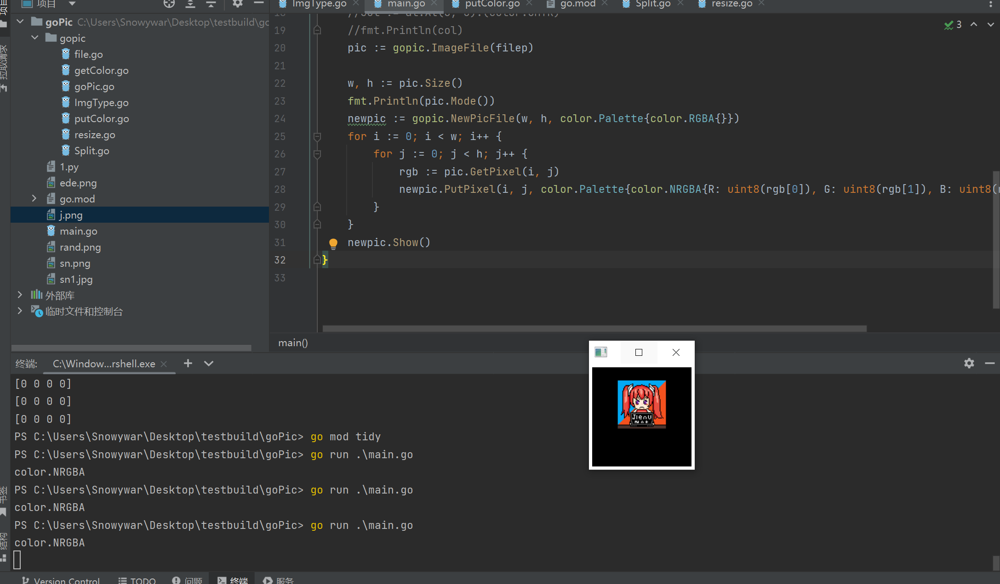

# goPic package

I was fed up with Golang's photo-processing abilities, so I wrote goPic！It's like the PIL package in Python！

## How To Install

```
go get -u github.com/jiayuqi7813/gopic
```

## Example

```
package main

import (
	"fmt"
	"image/color"
	"github.com/jiayuqi7813/gopic"
)

func main() {
	filep := "j.png"
	pic := gopic.ImageFile(filep)
	w, h := pic.Size()
	fmt.Println(pic.Mode())
	newpic := gopic.NewPicFile(w, h, color.Palette{color.RGBA{}})
	for i := 0; i < w; i++ {
		for j := 0; j < h; j++ {
			rgb := pic.GetPixel(i, j)
			newpic.PutPixel(i, j, color.Palette{color.NRGBA{R: uint8(rgb[0]), G: uint8(rgb[1]), B: uint8(rgb[2]), A: 255}})
		}
	}
	newpic.Show()
}
```



Welcome to use, and welcome to put forward issues, help our goPic better and better

# License

GPL3.0